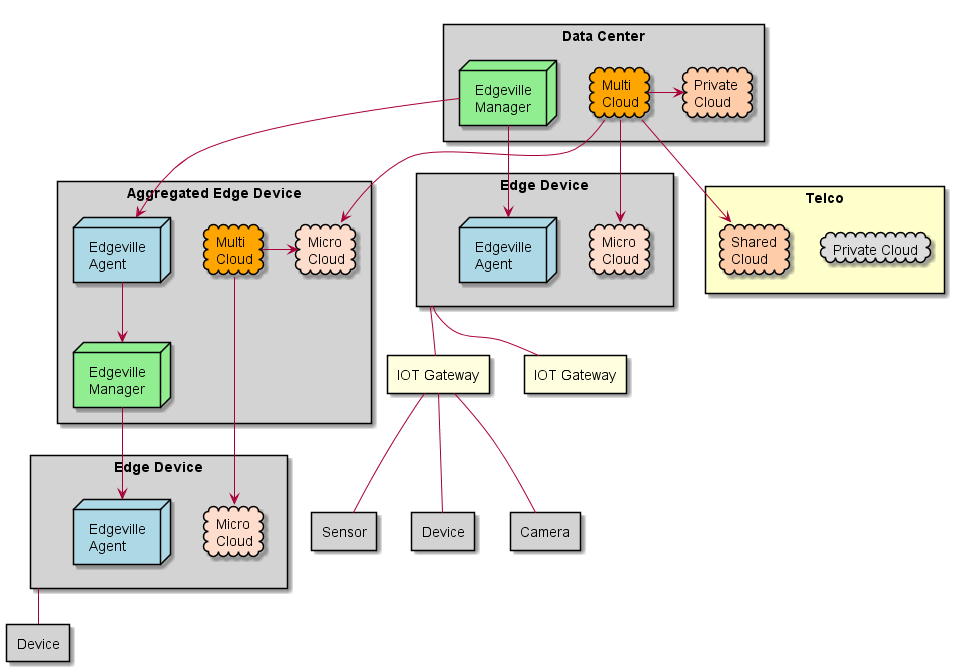

# Edgeville

Edgeville is a Conceptual Architecture for Edge to Data Center Computer and Analytics.
This does not include the end point devices like sensors, cameras, etc... but includes all
of the infrastructure and control for the aggregation of compute,storage and network across
the complete ecocsystem. 



## Conceptual Architecture

The design uses [plantuml](http://plantuml.com/) and [rst](http://www.sphinx-doc.org/en/master/usage/restructuredtext/basics.html)
to document the architecture.

Plantuml is a text based language that lets you describe UML diagrams. 
All of the plantuml graphic files are shown in the *.rst (ReStructure Text) files.
The document can be built using the building the plantuml and rst files into png and html files respectively.
To generate the graphic files (*.png) for the plantuml files (*.puml) do the following:
```
# npm run build-doc
```

Note that the build process uses docker images to perform a sphynix build to build the documentation.

### Documentation layout

The documentation for the architecture can be found in the **docs** directory.
The directory is layout as follows:
* **Actors** - documentation of the actors of the system
* **Solution** - Sub systems and solution of the system
* **UseCases** - List of Use Cases of the system.
* **Home.rst** - Main page in the documentation
* **index.rst** - index of the complete documentation. (uses the rst/sphynix format)

## Implementations

An implementation of the reference architecture is written using [sailsjs](http://sailsjs.org/) a nodejs MVC framework.
In addition to the bouquet pattern generator.

+ [Get started](https://sailsjs.com/get-started)
+ [Sails framework documentation](https://sailsjs.com/documentation)
* [Bouquet Pattern Generator](http://bouquet.readthedocs.io)


