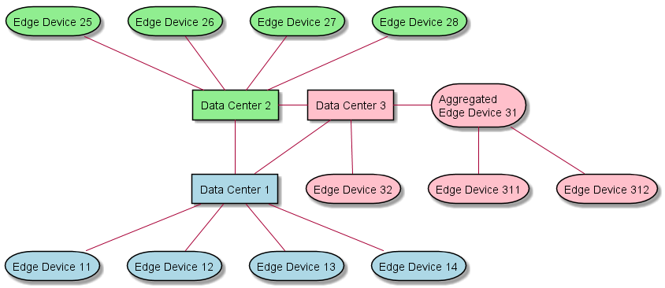
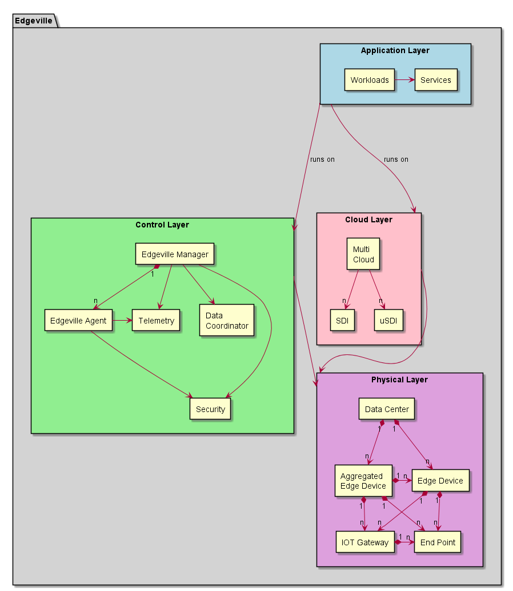

.. _Home:

Edgeville Overview
==================

The Edgeville conceptual architecture represents an Edge to Cloud distributed computing platform that can scale to millions
of edge devices or nodes. This architecture shows the use cases, and specs for implementing the Edgeville Architecture.
The architecture is broken up into several different components and sections. The system connects edge devices and data centers
together across three different aspects: Security, Control, and Cloud Applications.

High Level Use Cases
--------------------

* :ref:`UseCase-Manage-Applications`
* :ref:`UseCase-Manage-Cloud`
* :ref:`UseCase-Manage-Security`
* :ref:`UseCase-Manage-Infrastructure`

.. image:: /UseCases/UseCases.png

Users
-----

* :ref:`Actor-Application-Developer`
* :ref:`Actor-Dev-Ops`
* :ref:`Actor-Network-Engineer`
* :ref:`Actor-Operations-Manager`
* :ref:`Actor-Security-Engineer`

High Level Concepts
-------------------

* **Aggregated Edge Device** - This is an Edge Device that has other Edge Devices that it controls. The Aggregated Edge Device gives the ability to create topologies of control.
* **Edge Device** - This is a device contains Compute, storage and network sufficient to manage and control any number of devices or IOT Gateways.
* **IOT Gateway** - Controls multiple IOT Devices. Provides control and data from the IOT Devices to an Edge Device.
* **IOT Device** - This can be a Seonsor, Camera, etc.
* **Private Cloud** - A Cloud that is not shared outside of the owner of the Cloud. In this case it is owned by the Teleco and does not supply anything to a customer.
* **Shared Cloud** - A Cloud that a teleco can land services for a customer. The Shared cloud is multi-tenent and gives the Teleco the ability monetize their infrastructure.
* **SDI** - Software Definied Infrastructure. This is the base foundation to a Cloud. This provides a common API to the Cloud layers.
* **uSDI** - This is an SDI layer for a micro-cloud. the micro-cloud is the smallest possible layer for a cloud. Every Edge Device has a micro-cloud instance in it.
* **Common Cloud Core** - This is a true Multi-Cloud. It connects multiple clouds together to behave like one cloud. See the `C3 architecture <http://c3.readthedocs.io>`_ for details.

.. image:: HighLevel.png

Topologies
----------
The architecture is divided into Control and Cloud. The Control layer establishes a topology for controlling the phsyical edge devices, data centers, and IOT Gateways.
The control layer establishes topologies so the devices can be managed in a reasonable manner and can scale beyond the normal capabilities of a completely flat control plane.

In this example the "Data Center 2" controls the "Edge Device 2*". There is also an Aggregated Edge Device, "Aggregated Edge Device 31", that is the parent of the "Edge Devices 31*".
The Parent Child relationship shows that layers of control can be established. Different control toplogies can be established to give the ability to create extermely large networks
of Edge Devices and Data Centers.

The control topology is only one of the topologies that can be created. Edge Devices and Data Centers can be organized as a graph of clouds as well. This gives the ability to dynamically
create cloud topologies based on the applications or workflows being deployed on the ecosystem. In this example color is used to show how the Control topology can be independent of the
cloud topology.

Notice that a Control parent-child relationship does not pre-determine the parent-child relationship in a Cloud Topology.

Logical Architecture
--------------------

The Edgeville Architecture contains several subsystems and components. The following is a diagram on
how these components work together to fulfill the high level use cases.

* :ref:`SubSystem-Cloud` - contains all of the Subsystems for the cloud: :ref:`SubSystem-Cloud/SDI` , :ref:`SubSystem-Cloud/uSDI`, :ref:`SubSystem-Cloud/Common-Cloud-Core` responsible for application and service management.
* :ref:`SubSystem-Control` - contains all of the Subsystems for the control of the edge devices: :ref:`SubSystem-Control/Data-Coordinator`, :ref:`SubSystem-Control/Edgeville-Agent`, :ref:`SubSystem-Control/Edgeville-Manager`.
* :ref:`SubSystem-Security` - contains all of the Subsystems for the security of the edge and data centers: :ref:`SubSystem-Security/Encryption`, :ref:`SubSystem-Security/Identity-Manager`, :ref:`SubSystem-Security/Trust-Manager`
* :ref:`SubSystem-Telemetry` - contains all of Telemety Bus from multiple clouds, services and application stacks: :ref:`SubSystem-Telemetry/Telemetry-Aggregator`, :ref:`Subsystem-Telemetry/Telemetry-Bus`,  :ref:`Subsystem-Telemetry/Telemetry-Producer`,  :ref:`Subsystem-Telemetry/Telemetry-Subscriber`

