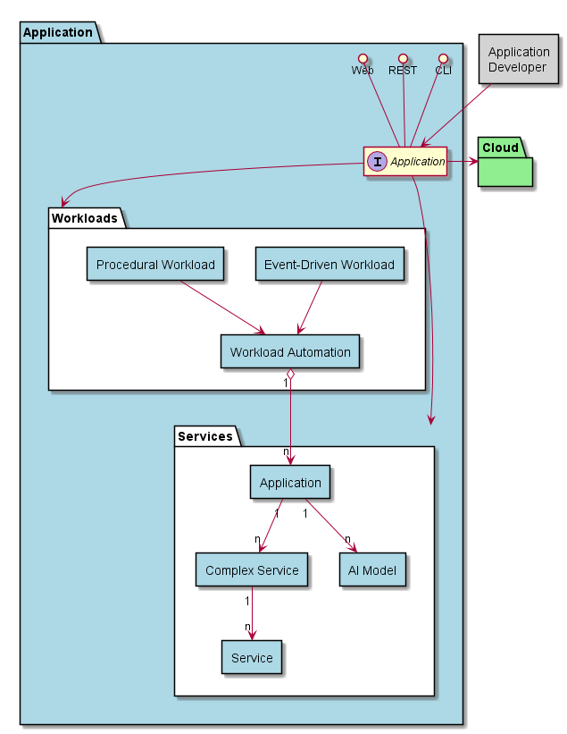

.. _SubSystem-Application:

Application
===========

Application is a layer of Edgeville Architecture. It consists of Services, Workloads and Analytics. Analytics utilizes
the Services and workload Sub Systems. Analytics is an example of how to utilize the Services and Workloads to
create new applications.

Use Cases
---------

* :ref:`UseCase-Manage-Applications`
* :ref:`Scenario-Deploy-Application`
* :ref:`Scenario-Deploy-Model`
* :ref:`Scenario-Deploy-Service`
* :ref:`Scenario-Deploy-Workload`
* :ref:`Scenario-Monitor-Application`
* :ref:`Scenario-Monitor-Model`
* :ref:`Scenario-Monitor-Service`
* :ref:`Scenario-Monitor-Workload`
* :ref:`Scenario-Update-Application`
* :ref:`Scenario-Update-Model`
* :ref:`Scenario-Update-Service`
* :ref:`Scenario-Update-Workload`

Users
-----

* :ref:`Actor-Application-Developer`

Uses
----

* :ref:`SubSystem-Cloud`
* :ref:`SubSystem-Application/Analytics`
* :ref:`SubSystem-Application/Services`
* :ref:`SubSystem-Application/Workloads`

Interface
---------

* CLI - Command Line Interface
* REST-API -
* Portal - Web Portal

Logical Artifacts
-----------------

* :ref:`SubSystem-Application/Analytics`
* :ref:`SubSystem-Application/Services`
* :ref:`SubSystem-Application/Workloads`

Activities and Flows
--------------------

The Application layer provides the following activities and flows.

Deployment Architecture
-----------------------

This subsystem is deployed using micro-services as shown in the diagram below. The 'micro' module is
used to implement the micro-services in the system.
The subsystem also has an CLI, REST and Web Interface exposed through a sailajs application. The sailsjs
application will interface with the micro-services and can monitor and drive work-flows through the mesh of
micro-services.

Physical Architecture
---------------------

The Application subsystem is is physically laid out on a hybrid cloud infrastructure. Each microservice is shown
how they connect to each other. All of the micro-services communicate to each other and the main app through a
REST interface. A CLI, REST or Web interface for the app is how other subsystems or actors interact. Requests are
forwarded to micro-services through the REST interface of each micro-service.

Micro-Services
--------------

* :ref:`Service-app`
* :ref:`Service-service`
* :ref:`Service-workload`
