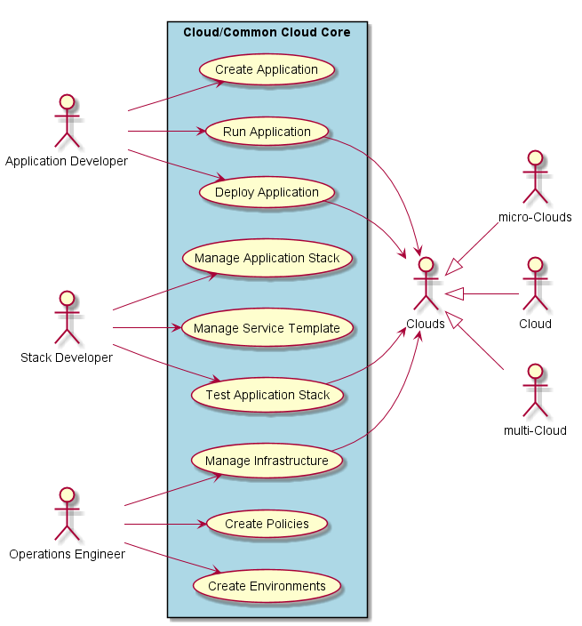
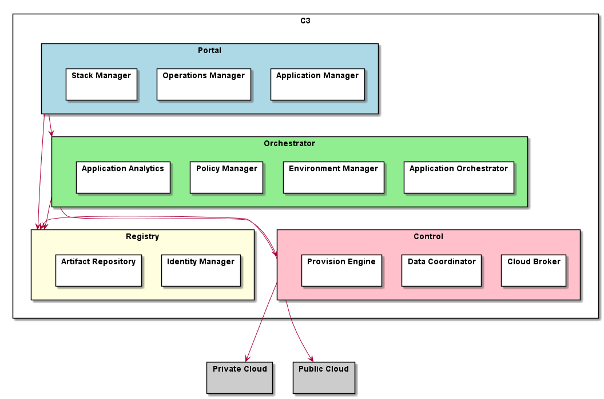

.. _SubSystem-Cloud/Common-Cloud-Core:

Cloud/Common Cloud Core
=======================

Cloud/Common Cloud Core is a subsystem of Edgeville Cloud Layer. It is an architecture
that can creates multi-cloud instances that manage and orchestrate services
across the ecosystem. Details of the C3 architecture can be found `here. <http:://c3.readthedocs.io>`_
The C3 Architecture is used primarily for its ability to connect multiple clouds together. And to manage complex
application and Service Orchestration across a large ecosystem of clouds and microclouds.

Use Cases
---------

For more detail information on the use cases check out the `documentation. <http://c3.readthedocs.io>`_

Logical Artifacts
-----------------

For more detail information on the architecture check out the `documentation. <http://c3.readthedocs.io>`_

