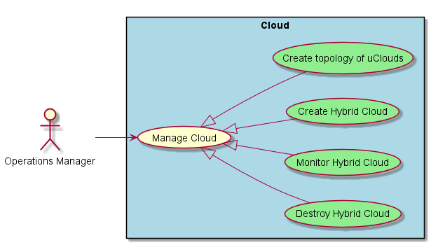
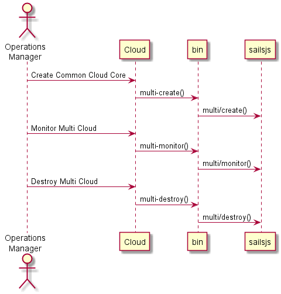
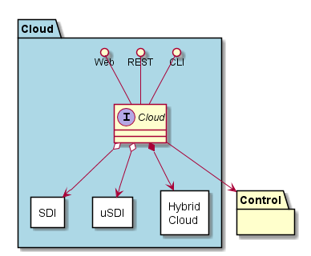
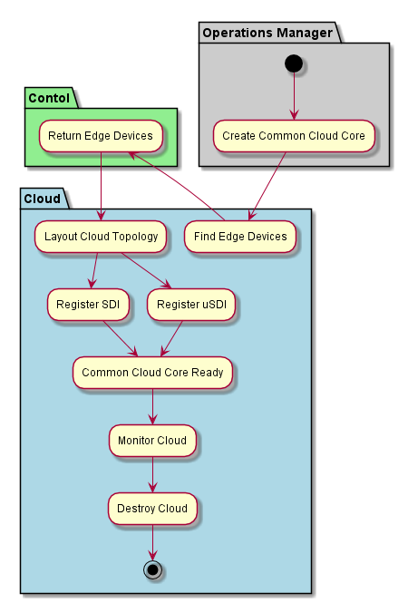
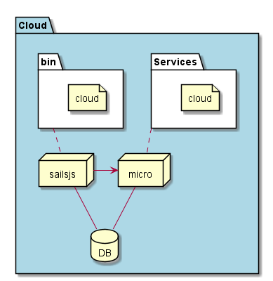
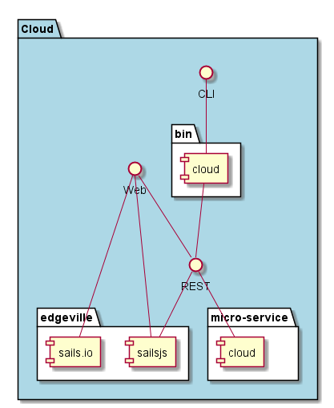

.. _SubSystem-Cloud:

Cloud
=====

Cloud is a layer of Edgeville Architecture. This layer contains all of the cloud subsystems including
:ref:`SubSystem-Cloud/Hybrid-Cloud`, :ref:`SubSystem-Cloud/SDI` and :ref:`SubSystem-Cloud/usDI` subsystems.
The Cloud layer gives the ability to create several hybrid clouds by combiuning SDI and uSDI subsystems together
in a dynamic manner. Different Cloud layouts (topologies) are used for different applications and workloads.

Use Cases
---------

* :ref:`UseCase-Manage-Cloud`
* :ref:`Scenario-Create-Hybrid-Cloud`
* :ref:`Scenario-Destroy-Hybrid-Cloud`
* :ref:`Scenario-Monitor-Hybrid-Cloud`
* :ref:`Scenario-Create-topology-of-uClouds`

Users
-----

* :ref:`Actor-Operations-Manager`

Uses
----

* :ref:`SubSystem-Cloud`

Interface
---------

* CLI - Command Line Interface
* REST-API -
* Portal - Web Portal

Logical Artifacts
-----------------

The Logical Artifacts of the Cloud layer are the different kinds of Clouds.

* :ref:`SubSystem-Hybrid-Cloud`
* :ref:`SubSystem-SDI`
* :ref:`SubSystem-uSDI`

Activities and Flows
--------------------

The Cloud layer provides the following activities and flows.

Deployment Architecture
-----------------------

This subsystem is deployed using micro-services as shown in the diagram below. The 'micro' module is
used to implement the micro-services in the system.
The subsystem also has an CLI, REST and Web Interface exposed through a sailajs application. The sailsjs
application will interface with the micro-services and can monitor and drive work-flows through the mesh of
micro-services.

Physical Architecture
---------------------

The Cloud subsystem is is physically laid out on a hybrid cloud infrastructure. Each microservice is shown
how they connect to each other. All of the micro-services communicate to each other and the main app through a
REST interface. A CLI, REST or Web interface for the app is how other subsystems or actors interact. Requests are
forwarded to micro-services through the REST interface of each micro-service.

Micro-Services
--------------

* :ref:`Service-cloud`
