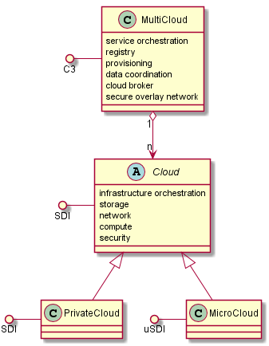

.. _SubSystem-Cloud:

Cloud
=====

Cloud is a layer of Edgeville Architecture. This layer contains all of the cloud subsystems including
:ref:`SubSystem-Cloud/Common-Cloud-Core`, :ref:`SubSystem-Cloud/SDI` and :ref:`SubSystem-Cloud/usDI` subsystems.
The Cloud layer gives the ability to create several multi clouds by combiuning SDI and uSDI subsystems together
in a dynamic manner. Different Cloud layouts (topologies) are used for different applications and workloads.

Use Cases
---------

* :ref:`UseCase-Manage-Cloud`
* :ref:`Scenario-Create-Common-Cloud-Core`
* :ref:`Scenario-Destroy-Common-Cloud-Core`
* :ref:`Scenario-Monitor-Common-Cloud-Core`
* :ref:`Scenario-Create-topology-of-uClouds`

.. image:: UseCases.png

Users
-----

The primary user of the Cloud Layer is the :ref:`Actor-Operations-Manager`. They will setup and manage the multi-cloud
ecosystems, manage topologies of clouds and monitor the cloud operations.

* :ref:`Actor-Operations-Manager`

.. image:: UserInteraction.png

Uses
----

* :ref:`SubSystem-Cloud`

Interface
---------

* CLI - Command Line Interface
* REST-API -
* Portal - Web Portal

Cloud Relationships
-------------------
This diagram shows the relationships between the clouds. It is important to note the differences between the Cloud
and the Multi-Cloud. The key differentiator is the fact the the Multi-Cloud orchestrates Services not infrastructure
like the Cloud does. Also not that the Multi-Cloud can manage 1 to many Clouds. By submitting requests to the Cloud.

Logical Artifacts
-----------------

The Logical Artifacts of the Cloud layer are the different kinds of Clouds. A common interface to managing the clouds
and multi-Cloud should be used. uSDI (mirco-SDI) for microClouds and SDI for all other clouds.

* :ref:`SubSystem-Cloud/Common-Cloud-Core` - Multi-Cloud functionality
* :ref:`SubSystem-Cloud/SDI` - Interface to the typical private and public cloud functionality
* :ref:`SubSystem-Cloud/uSDI` - Interface to the micro cloud interface.

.. image:: Logical.png

Activities and Flows
--------------------

The Cloud layer provides the following activities and flows.
The :ref:`Actor-Operations-Manager` Creates new multi-clouds using the C3 Architecture. The multi-cloud consists of
multiple micro-clouds, public clouds and private clouds. The topology of the clouds is established by the
:ref:`Actor_Operations_Manager`.

.. image::  Process.png

Deployment Architecture
-----------------------

This subsystem is deployed using micro-services as shown in the diagram below. The 'micro' module is
used to implement the micro-services in the system.
The subsystem also has an CLI, REST and Web Interface exposed through a sailajs application. The sailsjs
application will interface with the micro-services and can monitor and drive work-flows through the mesh of
micro-services.

.. image:: Deployment.png

Physical Architecture
---------------------

The Cloud subsystem is is physically laid out on a multi cloud infrastructure. Each microservice is shown
how they connect to each other. All of the micro-services communicate to each other and the main app through a
REST interface. A CLI, REST or Web interface for the app is how other subsystems or actors interact. Requests are
forwarded to micro-services through the REST interface of each micro-service.

.. image:: Physical.png

Micro-Services
--------------

There is one general microservice that is being used to create the cloud layer.

* :ref:`Service-cloud`
