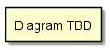

.. _SubSystem-Control/Data-Coordinator:

Control/Data Coordinator
========================

Control Layer/Data Coordinator is a subsystem of Edgeville ...

Use Cases
---------

*

.. image:: UseCases.png

Users
-----

* :ref:`Actor-User`

.. image:: UserInteraction.png

Uses
----

* :ref:`SubSystem-Control-Layer/Data-Coordinator`

Interface
---------

* CLI - Command Line Interface
* REST-API -
* Portal - Web Portal

Logical Artifacts
-----------------

*

Activities and Flows
--------------------

The Control Layer/Data Coordinator subsystem provides the following activities and flows.

.. image::  Process.png

Deployment Architecture
-----------------------

This subsystem is deployed using micro-services as shown in the diagram below. The 'micro' module is
used to implement the micro-services in the system.
The subsystem also has an CLI, REST and Web Interface exposed through a sailajs application. The sailsjs
application will interface with the micro-services and can monitor and drive work-flows through the mesh of
micro-services.

.. image:: Deployment.png

Physical Architecture
---------------------

The Control Layer/Data Coordinator subsystem is is physically laid out on a multi cloud infrastructure. Each microservice is shown
how they connect to each other. All of the micro-services communicate to each other and the main app through a
REST interface. A CLI, REST or Web interface for the app is how other subsystems or actors interact. Requests are
forwarded to micro-services through the REST interface of each micro-service.

Micro-Services
--------------

* :ref:`Service-service-name`
