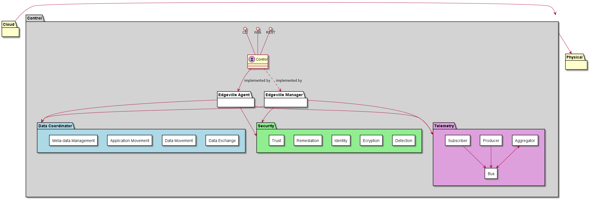
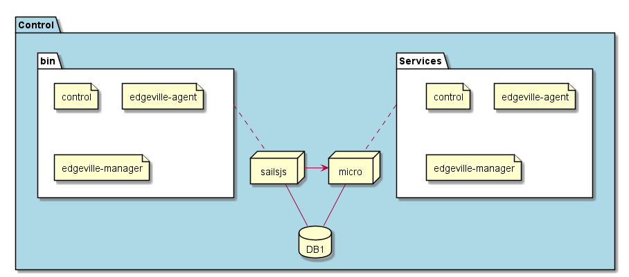

.. _SubSystem-Control:

Control
=======

Control layer contains the subsystems that control the edge devices. The Control layer manages the physical hardware in
the Data Center and Edge Devices. This is different than the Cloud Layer which manages the SDI systems and applications
running in the ecocsystem.

Use Cases
---------

* :ref:`UseCase-Manage-Infrastructure`
* :ref:`Scenario-Create-Aggregated-Edge-Device`
* :ref:`Scenario-Create-Edge-Device`
* :ref:`Scenario-Register-Aggregated-Edge-Device`
* :ref:`Scenario-Register-Edge-Device`
* :ref:`Scenario-Register-Edge-Device`
* :ref:`Scenario-Monitor-Edge-Device`
* :ref:`Scenario-Monitor-Data-Center-Hardware`
* :ref:`Scenario-Update-Data-Center-Hardware`
* :ref:`Scenario-Update-Edge-Device`

Users
-----

* :ref:`Actor-Operations-Manager`

Uses
----

* :ref:`SubSystem-Control`

Interface
---------

* CLI - Command Line Interface
* REST-API -
* Portal - Web Portal

Logical Artifacts
-----------------

* :ref:`SubSystem-Control/Data-Coordinator`
* :ref:`SubSystem-Control/Edgeville-Agent`
* :ref:`SubSystem-Control/Edgeville-Manager`
* :ref:`SubSystem-Control/Security`
* :ref:`SubSystem-Control/Telemetry`

Activities and Flows
--------------------

The Control subsystem provides the following activities and flows.

Deployment Architecture
-----------------------

This subsystem is deployed using micro-services as shown in the diagram below. The 'micro' module is
used to implement the micro-services in the system.
The subsystem also has an CLI, REST and Web Interface exposed through a sailajs application. The sailsjs
application will interface with the micro-services and can monitor and drive work-flows through the mesh of
micro-services.

Physical Architecture
---------------------

The Control subsystem is is physically laid out on a multi cloud infrastructure. Each microservice is shown
how they connect to each other. All of the micro-services communicate to each other and the main app through a
REST interface. A CLI, REST or Web interface for the app is how other subsystems or actors interact. Requests are
forwarded to micro-services through the REST interface of each micro-service.

Micro-Services
--------------

* :ref:`Service-control`
