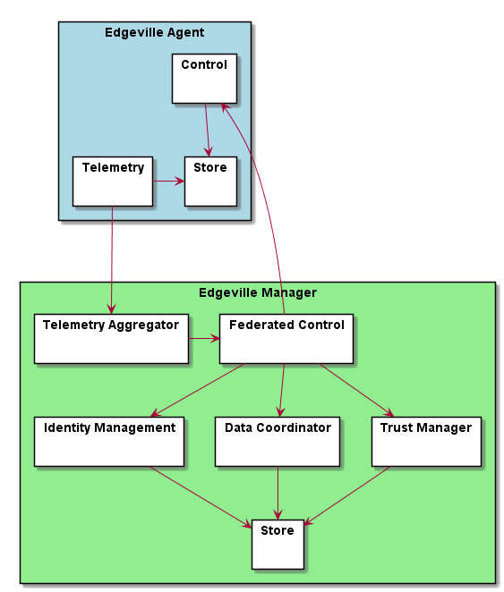
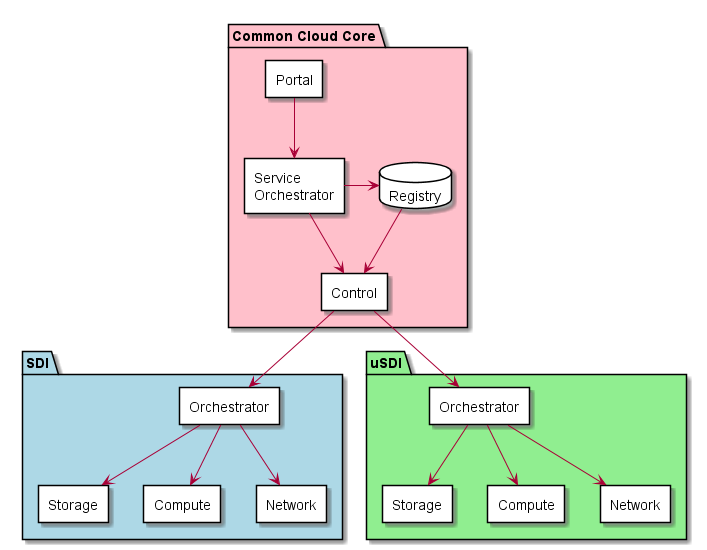
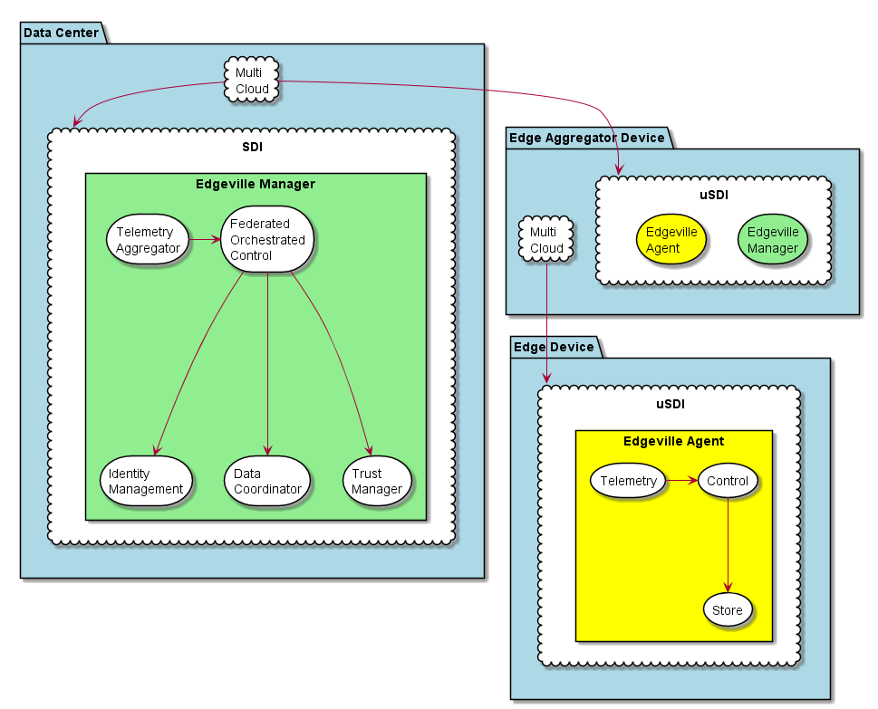
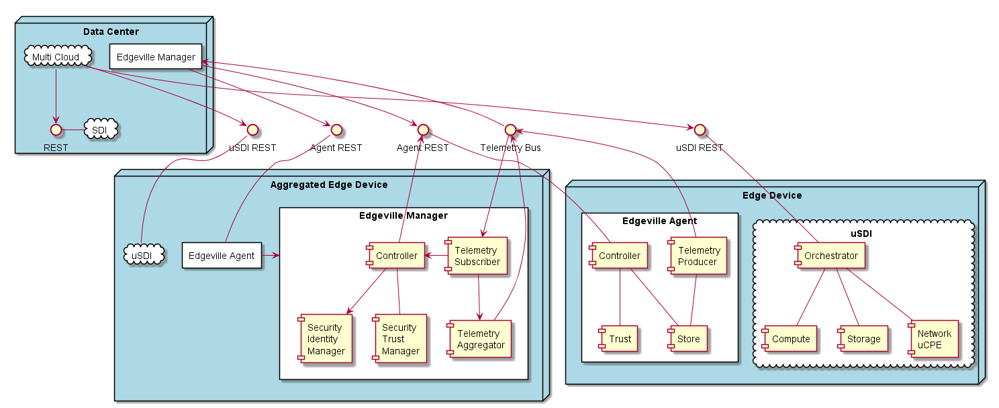

Generic Solution Overview
=========================
The Edgeville conceptual architecture represents an Edge to Cloud distributed computing platform that can scale to millions
of edge devices or nodes. This architecture shows the use cases, and specs for implementing the Edgeville Architecture.
The architecture is broken up into several different components and sections. The system connects edge devices and data centers
together across three different aspects: Security, Control, and Cloud Applications.

High Level Use Cases
--------------------

* :ref:`UseCase-Manage-Applications`
* :ref:`UseCase-Manage-Cloud`
* :ref:`UseCase-Manage-Security`
* :ref:`UseCase-Manage-Infrastructure`

.. image:: /UseCases/UseCases.png

Users
-----

* :ref:`Actor-Application-Developer`
* :ref:`Actor-Dev-Ops`
* :ref:`Actor-Network-Engineer`
* :ref:`Actor-Operations-Manager`
* :ref:`Actor-Security-Engineer`

High Level Architecture
-----------------------

The Edgeville Architecture contains several subsystems and components. The following is a diagram on
how these components work together to fulfill the high level use cases.

* :ref:`SubSystem-Cloud` - contains all of the Subsystems for the cloud: :ref:`SubSystem-Cloud/SDI` , :ref:`SubSystem-Cloud/uSDI`, :ref:`SubSystem-Cloud/Common-Cloud-Core` responsible for application and service management.
* :ref:`SubSystem-Control` - contains all of the Subsystems for the control of the edge devices: :ref:`SubSystem-Control/Data-Coordinator`, :ref:`SubSystem-Control/Edgeville-Agent`, :ref:`SubSystem-Control/Edgeville-Manager`.
* :ref:`SubSystem-Security` - contains all of the Subsystems for the security of the edge and data centers: :ref:`SubSystem-Security/Encryption`, :ref:`SubSystem-Security/Identity-Manager`, :ref:`SubSystem-Security/Trust-Manager`
* :ref:`SubSystem-Telemetry` - contains all of Telemety Bus from multiple clouds, services and application stacks: :ref:`SubSystem-Telemetry/Telemetry-Aggregator`, :ref:`Subsystem-Telemetry/Telemetry-Bus`,  :ref:`Subsystem-Telemetry/Telemetry-Producer`,  :ref:`Subsystem-Telemetry/Telemetry-Subscriber`

.. image:: HighLevelLogical.png

The Edgeville architecture has two aspects: Control and Cloud. The Control layer contains the Control, Security, and Telemetry. The Cloud layer contains Common Cloud Core, SDI and uSDI.

Control Layer
-------------

The Control layer utilizes the Control, Security, and Telemetry subsystems by laying down the software on an Agent and Manager pattern.

The Edgeville Agent is a lightweight proccess that resides in Edge Devices/Aggregated Edge Devices and controls the infrastructure,
stores special data (security keys, hints, metrics), and sends telemetry into the Telemetry Bus.

The Edgeville Manager resides in the Data Centers/Aggregated Edge Devices it a small set of services that has a Telemetry Aggregator,
Data Coordinator, Trust Manager, Federated Control, Store

Cloud Architecture
------------------

The Cloud Layer consists of Common Cloud Cores, SDI, and uSDI SubSystems.

* :ref:`SubSystem-Cloud/Common-Cloud-Core` - Common Cloud Core orchestrates services across multiple clouds. It is responsible application and service orchestration.
* :ref:`SubSystem-Cloud/SDI` - This is a typical Private Cloud Interface. Responsible for orchesrating Infrastructure in the cloud.
* :ref:`SubSystem-Cloud/uSDI` - This is a micro-cloud interface. Responsible for orchestrating infrastructure in the micro-cloud.

Deployment model
----------------

The architecture consists of several micro services that form the application this diagram shows how those
micro-services are connected together, deployed and storage requirements. The Agent and Manager services have microservices
that provide the the functional required for the control and cloud functionality of the architecture.

Physical Architecture
---------------------

This is the physical layout of micro-services on the nodes in a Cloud or multiple Clouds. Including interface and connections between the different components.

Process Architecture
--------------------

The subsystems of Edgeville request information from each other to accomplish the use cases of the system.
This diagram shows how these microservices are connected and what they share between each other.
Creating Trusted edge devices and aggregated edge devices are in important aspect of the architecture.
As each Edge Device is brought up it follows the Security Chain of Trust protocol described in the :ref:`SubSystem-Security`
sub-system. When an Edge Device is attested it notifies its Edgeville Manager (Aggregated Edge Device or Data Center) that it
is available. When and Edgeville Manager is notified of its children's availability it notifies its parent Edge Manager
if one exists until the complete ecosystem is brought up.

