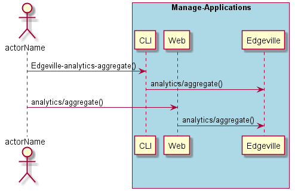
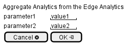

.. _Scenario-Aggregate-Analytics-from-the-Edge-Analytics:

Aggregate Analytics from the Edge Analytics
===========================================

Aggregate Analytics from the Edge Analytics using CLI and Web Interface with ... <parameters>

**CLI**

This is the command line interface for the Aggregate Analytics from the Edge Analytics Scenario.

.. code-block:: none

  # Edgeville analytics aggregate <parameters>
  # Edgeville analytics aggregate exmaple

**Web Interface**

This is a mock up of the Web Interface for the Aggregate Analytics from the Edge Analytics Scenario.

**REST**

This is the RESTful interface for the scenario.

*analytics/aggregate*

============  ========  ===================
Name          Value     Description
------------  --------  -------------------
parameter1    value1    Description1
============  ========  ===================
