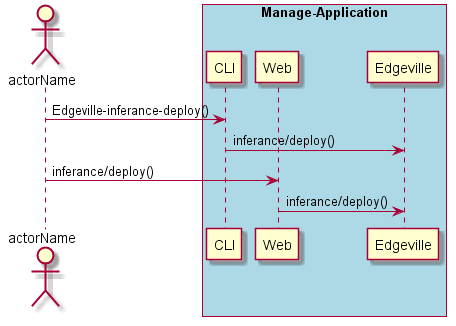
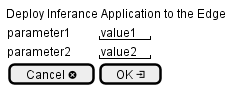

.. _Scenario-Deploy-Inferance-Application-to-the-Edge:

Deploy Inferance Application to the Edge
========================================

Deploy Inferance Application to the Edge using CLI and Web Interface with ... <parameters>

**CLI**

This is the command line interface for the Deploy Inferance Application to the Edge Scenario.

.. code-block:: none

  # Edgeville inferance deploy <parameters>
  # Edgeville inferance deploy exmaple

**Web Interface**

This is a mock up of the Web Interface for the Deploy Inferance Application to the Edge Scenario.

**REST**

This is the RESTful interface for the scenario.

*inferance/deploy*

============  ========  ===================
Name          Value     Description
------------  --------  -------------------
parameter1    value1    Description1
============  ========  ===================
