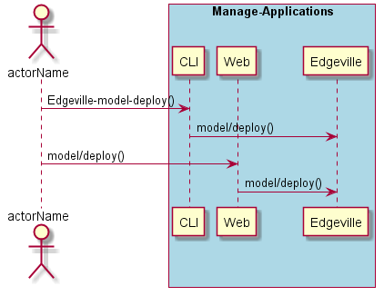
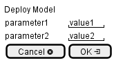

.. _Scenario-Deploy-Model:

Deploy Model
============

Deploy Model using CLI and Web Interface with ... <parameters>

**CLI**

This is the command line interface for the Deploy Model Scenario.

.. code-block:: none

  # Edgeville model deploy <parameters>
  # Edgeville model deploy exmaple

**Web Interface**

This is a mock up of the Web Interface for the Deploy Model Scenario.

**REST**

This is the RESTful interface for the scenario.

*model/deploy*

============  ========  ===================
Name          Value     Description
------------  --------  -------------------
parameter1    value1    Description1
============  ========  ===================
