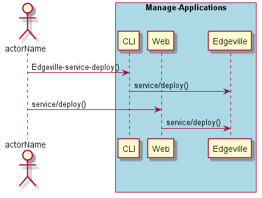
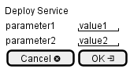

.. _Scenario-Deploy-Service:

Deploy Service
==============

Deploy Service using CLI and Web Interface with ... <parameters>

**CLI**

This is the command line interface for the Deploy Service Scenario.

.. code-block:: none

  # Edgeville service deploy <parameters>
  # Edgeville service deploy exmaple

**Web Interface**

This is a mock up of the Web Interface for the Deploy Service Scenario.

**REST**

This is the RESTful interface for the scenario.

*service/deploy*

============  ========  ===================
Name          Value     Description
------------  --------  -------------------
parameter1    value1    Description1
============  ========  ===================
