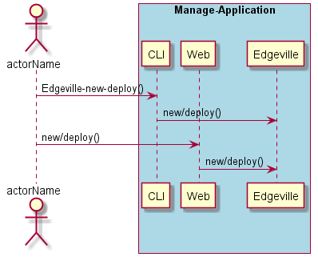
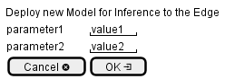

.. _Scenario-Deploy-new-Model-for-Inference-to-the-Edge:

Deploy new Model for Inference to the Edge
==========================================

Deploy new Model for Inference to the Edge using CLI and Web Interface with ... <parameters>

**CLI**

This is the command line interface for the Deploy new Model for Inference to the Edge Scenario.

.. code-block:: none

  # Edgeville new deploy <parameters>
  # Edgeville new deploy exmaple

**Web Interface**

This is a mock up of the Web Interface for the Deploy new Model for Inference to the Edge Scenario.

**REST**

This is the RESTful interface for the scenario.

*new/deploy*

============  ========  ===================
Name          Value     Description
------------  --------  -------------------
parameter1    value1    Description1
============  ========  ===================
