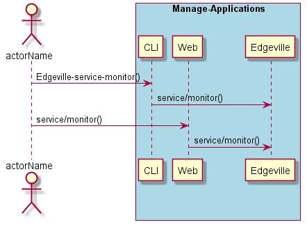
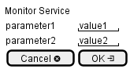

.. _Scenario-Monitor-Service:

Monitor Service
===============

Monitor Service using CLI and Web Interface with ... <parameters>

**CLI**

This is the command line interface for the Monitor Service Scenario.

.. code-block:: none

  # Edgeville service monitor <parameters>
  # Edgeville service monitor exmaple

**Web Interface**

This is a mock up of the Web Interface for the Monitor Service Scenario.

**REST**

This is the RESTful interface for the scenario.

*service/monitor*

============  ========  ===================
Name          Value     Description
------------  --------  -------------------
parameter1    value1    Description1
============  ========  ===================
