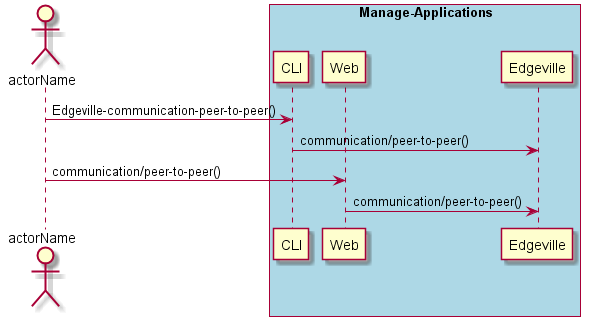
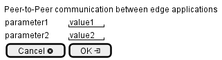

.. _Scenario-Peer-to-Peer-communication-between-edge-applications:

Peer-to-Peer communication between edge applications
====================================================

Peer-to-Peer communication between edge applications using CLI and Web Interface with ... <parameters>

**CLI**

This is the command line interface for the Peer-to-Peer communication between edge applications Scenario.

.. code-block:: none

  # Edgeville communication peer-to-peer <parameters>
  # Edgeville communication peer-to-peer exmaple

**Web Interface**

This is a mock up of the Web Interface for the Peer-to-Peer communication between edge applications Scenario.

**REST**

This is the RESTful interface for the scenario.

*communication/peer-to-peer*

============  ========  ===================
Name          Value     Description
------------  --------  -------------------
parameter1    value1    Description1
============  ========  ===================
