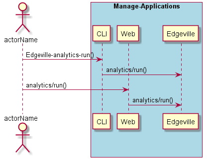
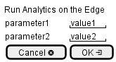

.. _Scenario-Run-Analytics-on-the-Edge-:

Run Analytics on the Edge

==========================

Run Analytics on the Edge
 using CLI and Web Interface with ... <parameters>

**CLI**

This is the command line interface for the Run Analytics on the Edge
 Scenario.

.. code-block:: none

  # Edgeville analytics run <parameters>
  # Edgeville analytics run exmaple

**Web Interface**

This is a mock up of the Web Interface for the Run Analytics on the Edge
 Scenario.

**REST**

This is the RESTful interface for the scenario.

*analytics/run*

============  ========  ===================
Name          Value     Description
------------  --------  -------------------
parameter1    value1    Description1
============  ========  ===================
