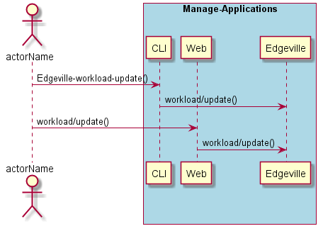

.. _Scenario-Update-Workload:

Update Workload
===============

Update Workload using CLI and Web Interface with ... <parameters>

**CLI**

This is the command line interface for the Update Workload Scenario.

.. code-block:: none

  # Edgeville workload update <parameters>
  # Edgeville workload update exmaple

**Web Interface**

This is a mock up of the Web Interface for the Update Workload Scenario.

**REST**

This is the RESTful interface for the scenario.

*workload/update*

============  ========  ===================
Name          Value     Description
------------  --------  -------------------
parameter1    value1    Description1
============  ========  ===================
