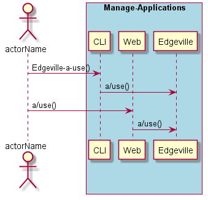
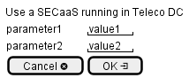

.. _Scenario-Use-a-SECaaS-running-in-Teleco-DC:

Use a SECaaS running in Teleco DC
=================================

Use a SECaaS running in Teleco DC using CLI and Web Interface with ... <parameters>

**CLI**

This is the command line interface for the Use a SECaaS running in Teleco DC Scenario.

.. code-block:: none

  # Edgeville a use <parameters>
  # Edgeville a use exmaple

**Web Interface**

This is a mock up of the Web Interface for the Use a SECaaS running in Teleco DC Scenario.

**REST**

This is the RESTful interface for the scenario.

*a/use*

============  ========  ===================
Name          Value     Description
------------  --------  -------------------
parameter1    value1    Description1
============  ========  ===================
