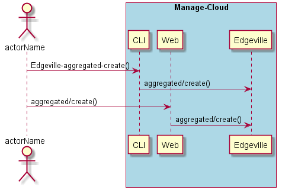
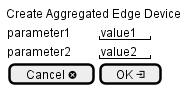

.. _Scenario-Create-Aggregated-Edge-Device:

Create Aggregated Edge Device
=============================

Create Aggregated Edge Device using CLI and Web Interface with ... <parameters>

**CLI**

This is the command line interface for the Create Aggregated Edge Device Scenario.

.. code-block:: none

  # Edgeville aggregated create <parameters>
  # Edgeville aggregated create exmaple

**Web Interface**

This is a mock up of the Web Interface for the Create Aggregated Edge Device Scenario.

**REST**

This is the RESTful interface for the scenario.

*aggregated/create*

============  ========  ===================
Name          Value     Description
------------  --------  -------------------
parameter1    value1    Description1
============  ========  ===================
