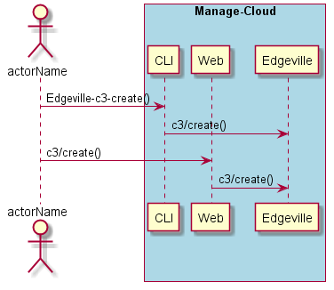

.. _Scenario-Create-Common-Cloud-Core:

Create Multi Cloud
===================

Create Multi Cloud using CLI and Web Interface with ... <parameters>

**CLI**

This is the command line interface for the Create Multi Cloud Scenario.

.. code-block:: none

  # Edgeville multi create <parameters>
  # Edgeville multi create exmaple

**Web Interface**

This is a mock up of the Web Interface for the Create Multi Cloud Scenario.

.. image:: Create-Common-Cloud-CoreWeb.png

**REST**

This is the RESTful interface for the scenario.

*multi/create*

============  ========  ===================
Name          Value     Description
------------  --------  -------------------
parameter1    value1    Description1
============  ========  ===================
