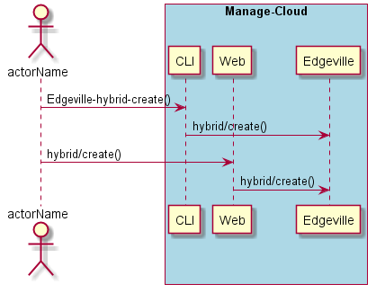
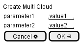

.. _Scenario-Create-Hybrid-Cloud:

Create Hybrid Cloud
===================

Create Hybrid Cloud using CLI and Web Interface with ... <parameters>

**CLI**

This is the command line interface for the Create Hybrid Cloud Scenario.

.. code-block:: none

  # Edgeville hybrid create <parameters>
  # Edgeville hybrid create exmaple

**Web Interface**

This is a mock up of the Web Interface for the Create Hybrid Cloud Scenario.

**REST**

This is the RESTful interface for the scenario.

*hybrid/create*

============  ========  ===================
Name          Value     Description
------------  --------  -------------------
parameter1    value1    Description1
============  ========  ===================
