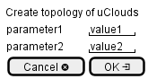

.. _Scenario-Create-topology-of-uClouds:

Create topology of uClouds
==========================

Create topology of uClouds using CLI and Web Interface with ... <parameters>

**CLI**

This is the command line interface for the Create topology of uClouds Scenario.

.. code-block:: none

  # Edgeville topology create <parameters>
  # Edgeville topology create exmaple

**Web Interface**

This is a mock up of the Web Interface for the Create topology of uClouds Scenario.

**REST**

This is the RESTful interface for the scenario.

*topology/create*

============  ========  ===================
Name          Value     Description
------------  --------  -------------------
parameter1    value1    Description1
============  ========  ===================
