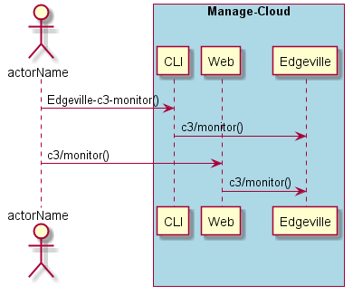

.. _Scenario-Monitor-Common-Cloud-Core:

Monitor Multi Cloud
====================

Monitor Multi Cloud using CLI and Web Interface with ... <parameters>

**CLI**

This is the command line interface for the Monitor Multi Cloud Scenario.

.. code-block:: none

  # Edgeville multi monitor <parameters>
  # Edgeville multi monitor exmaple

**Web Interface**

This is a mock up of the Web Interface for the Monitor Multi Cloud Scenario.

**REST**

This is the RESTful interface for the scenario.

*multi/monitor*

============  ========  ===================
Name          Value     Description
------------  --------  -------------------
parameter1    value1    Description1
============  ========  ===================
