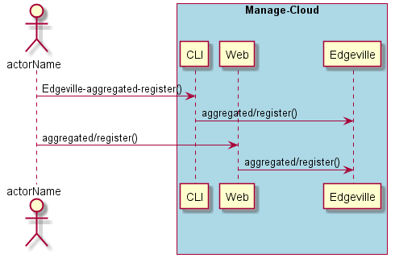
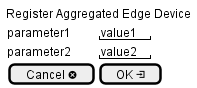

.. _Scenario-Register-Aggregated-Edge-Device:

Register Aggregated Edge Device
===============================

Register Aggregated Edge Device using CLI and Web Interface with ... <parameters>

**CLI**

This is the command line interface for the Register Aggregated Edge Device Scenario.

.. code-block:: none

  # Edgeville aggregated register <parameters>
  # Edgeville aggregated register exmaple

**Web Interface**

This is a mock up of the Web Interface for the Register Aggregated Edge Device Scenario.

**REST**

This is the RESTful interface for the scenario.

*aggregated/register*

============  ========  ===================
Name          Value     Description
------------  --------  -------------------
parameter1    value1    Description1
============  ========  ===================
