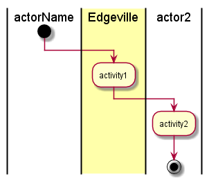

.. _UseCase-Manage-Infrastructure:

Manage Infrastructure
=====================

*Add Description*

Actors
------

* :ref:`Actor-User`

Activities
----------

* Activity from the diagram

Systems Involved
----------------

* :ref:`SubSystem-System`

Detail Scenarios
----------------

.. toctree::
   :glob:
   :maxdepth: 1

   Scenario*

