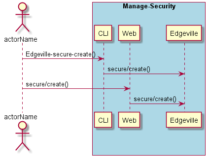
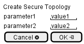

.. _Scenario-Create-Secure-Topology:

Create Secure Topology
======================

Create Secure Topology using CLI and Web Interface with ... <parameters>

**CLI**

This is the command line interface for the Create Secure Topology Scenario.

.. code-block:: none

  # Edgeville secure create <parameters>
  # Edgeville secure create exmaple

**Web Interface**

This is a mock up of the Web Interface for the Create Secure Topology Scenario.

**REST**

This is the RESTful interface for the scenario.

*secure/create*

============  ========  ===================
Name          Value     Description
------------  --------  -------------------
parameter1    value1    Description1
============  ========  ===================
