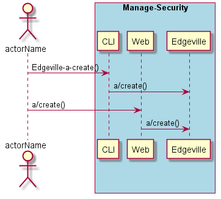
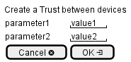

.. _Scenario-Create-a-Trust-between-devices:

Create a Trust between devices
==============================

Create a Trust between devices using CLI and Web Interface with ... <parameters>

**CLI**

This is the command line interface for the Create a Trust between devices Scenario.

.. code-block:: none

  # Edgeville a create <parameters>
  # Edgeville a create exmaple

**Web Interface**

This is a mock up of the Web Interface for the Create a Trust between devices Scenario.

**REST**

This is the RESTful interface for the scenario.

*a/create*

============  ========  ===================
Name          Value     Description
------------  --------  -------------------
parameter1    value1    Description1
============  ========  ===================
