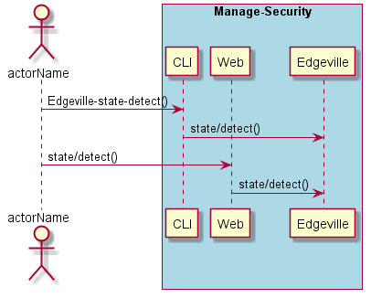
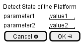

.. _Scenario-Detect-State-of-the-Platform:

Detect State of the Platform
============================

Detect State of the Platform using CLI and Web Interface with ... <parameters>

**CLI**

This is the command line interface for the Detect State of the Platform Scenario.

.. code-block:: none

  # Edgeville state detect <parameters>
  # Edgeville state detect exmaple

**Web Interface**

This is a mock up of the Web Interface for the Detect State of the Platform Scenario.

**REST**

This is the RESTful interface for the scenario.

*state/detect*

============  ========  ===================
Name          Value     Description
------------  --------  -------------------
parameter1    value1    Description1
============  ========  ===================
