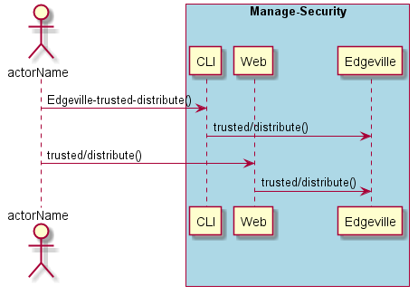
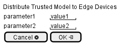

.. _Scenario-Distribute-Trusted-Model-to-Edge-Devices:

Distribute Trusted Model to Edge Devices
========================================

Distribute Trusted Model to Edge Devices using CLI and Web Interface with ... <parameters>

**CLI**

This is the command line interface for the Distribute Trusted Model to Edge Devices Scenario.

.. code-block:: none

  # Edgeville trusted distribute <parameters>
  # Edgeville trusted distribute exmaple

**Web Interface**

This is a mock up of the Web Interface for the Distribute Trusted Model to Edge Devices Scenario.

**REST**

This is the RESTful interface for the scenario.

*trusted/distribute*

============  ========  ===================
Name          Value     Description
------------  --------  -------------------
parameter1    value1    Description1
============  ========  ===================
