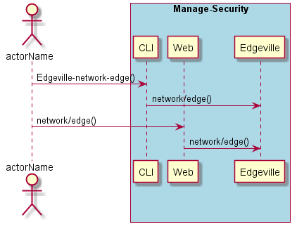
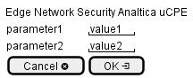

.. _Scenario-Edge-Network-Security-Analtica-uCPE:

Edge Network Security Analtica uCPE
===================================

Edge Network Security Analtica uCPE using CLI and Web Interface with ... <parameters>

**CLI**

This is the command line interface for the Edge Network Security Analtica uCPE Scenario.

.. code-block:: none

  # Edgeville network edge <parameters>
  # Edgeville network edge exmaple

**Web Interface**

This is a mock up of the Web Interface for the Edge Network Security Analtica uCPE Scenario.

**REST**

This is the RESTful interface for the scenario.

*network/edge*

============  ========  ===================
Name          Value     Description
------------  --------  -------------------
parameter1    value1    Description1
============  ========  ===================
