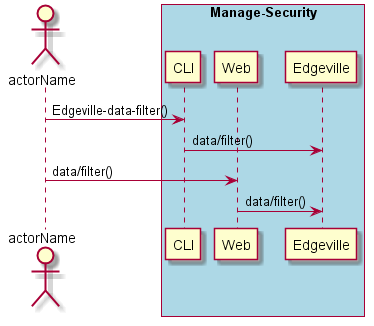
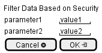

.. _Scenario-Filter-Data-Based-on-Security:

Filter Data Based on Security
=============================

Filter Data Based on Security using CLI and Web Interface with ... <parameters>

**CLI**

This is the command line interface for the Filter Data Based on Security Scenario.

.. code-block:: none

  # Edgeville data filter <parameters>
  # Edgeville data filter exmaple

**Web Interface**

This is a mock up of the Web Interface for the Filter Data Based on Security Scenario.

**REST**

This is the RESTful interface for the scenario.

*data/filter*

============  ========  ===================
Name          Value     Description
------------  --------  -------------------
parameter1    value1    Description1
============  ========  ===================
