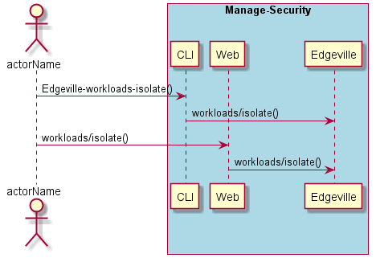
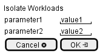

.. _Scenario-Isolate-Workloads:

Isolate Workloads
=================

Isolate Workloads using CLI and Web Interface with ... <parameters>

**CLI**

This is the command line interface for the Isolate Workloads Scenario.

.. code-block:: none

  # Edgeville workloads isolate <parameters>
  # Edgeville workloads isolate exmaple

**Web Interface**

This is a mock up of the Web Interface for the Isolate Workloads Scenario.

**REST**

This is the RESTful interface for the scenario.

*workloads/isolate*

============  ========  ===================
Name          Value     Description
------------  --------  -------------------
parameter1    value1    Description1
============  ========  ===================
