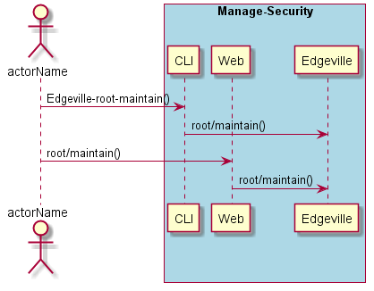
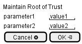

.. _Scenario-Maintain-Root-of-Trust:

Maintain Root of Trust
======================

Maintain Root of Trust using CLI and Web Interface with ... <parameters>

**CLI**

This is the command line interface for the Maintain Root of Trust Scenario.

.. code-block:: none

  # Edgeville root maintain <parameters>
  # Edgeville root maintain exmaple

**Web Interface**

This is a mock up of the Web Interface for the Maintain Root of Trust Scenario.

**REST**

This is the RESTful interface for the scenario.

*root/maintain*

============  ========  ===================
Name          Value     Description
------------  --------  -------------------
parameter1    value1    Description1
============  ========  ===================
