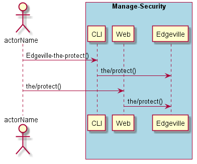
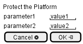

.. _Scenario-Protect-the-Platform:

Protect the Platform
====================

Protect the Platform using CLI and Web Interface with ... <parameters>

**CLI**

This is the command line interface for the Protect the Platform Scenario.

.. code-block:: none

  # Edgeville the protect <parameters>
  # Edgeville the protect exmaple

**Web Interface**

This is a mock up of the Web Interface for the Protect the Platform Scenario.

**REST**

This is the RESTful interface for the scenario.

*the/protect*

============  ========  ===================
Name          Value     Description
------------  --------  -------------------
parameter1    value1    Description1
============  ========  ===================
