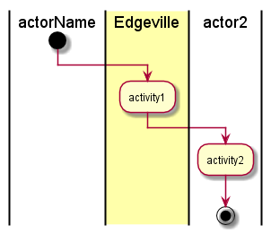

.. _UseCase-Manage-Security:

Manage Security
===============

*Add Description*

Actors
------

* :ref:`Actor-Operations-Manager`

Activities
----------

* Activity from the diagram

Systems Involved
----------------

* :ref:`SubSystem-Control`
* :ref:`SubSystem-Physical`

Detail Scenarios
----------------

.. toctree::
   :glob:
   :maxdepth: 1

   Scenario*

